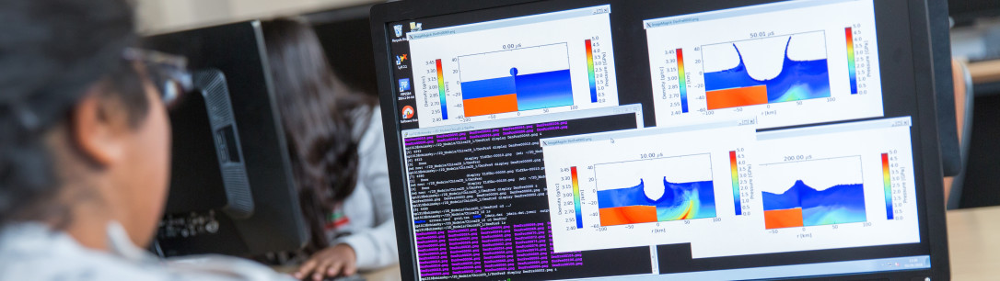

# MSc Applied Computational Science & Engineering 2020

<h3><it>Inspiring the future generations of experts in Computational Science and Engineering</it></h3>

## Current students

Please see the navigation bar to the left for course materials for specific modules.

## Prospective students

For more information, or to apply for 2021 entry, please see the [course page](https://www.imperial.ac.uk/study/pg/earth-science/computational-science/) on the Imperial College website.

Please contact the Education Administrator, Ying Ashton, with any further queries about the course: ese-msc-acse@imperial.ac.uk
